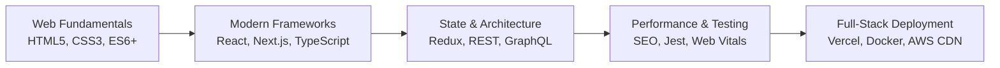
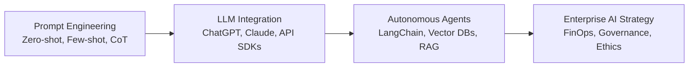
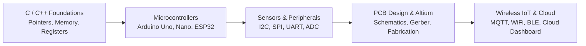
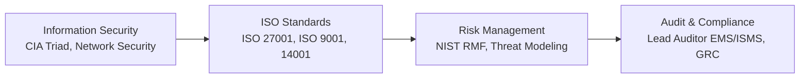
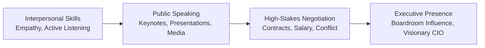

# Awesome Developer & Engineering Roadmaps 2026 🗺️

> Community-driven, step-by-step career roadmaps, skill trees, and accredited certification tracks on [Lucebra](https://www.lucebra.com).

> 🌐 **Global Accessibility:** All courses include synchronous **AI-powered subtitles in 99+ languages**, verifiable digital certificates, and full offline mobile support across 33 native platform locales.

---

## 🎁 Exclusive Developer, Team & Business Perks

| Coupon Code | Exclusive Offer & Perk | Target Plan | Direct Activation Link |
| :--- | :--- | :--- | :--- |
| **`BB30TRIAL`** | **Extended 30-Day Free Trial** (Full access, unlimited seats) | Lucebra Business | [👉 Activate 30-Day Trial](https://www.lucebra.com/business-checkout?coupon=BB30TRIAL) |
| **`LCBR25EB`** | **50% OFF Lifetime Discount + 7-Day Free Trial** | Lucebra Business | [👉 Activate 50% Off Deal](https://www.lucebra.com/business-checkout?coupon=LCBR25EB) |

### 🎁 Lucebra Member Rewards — Exclusive Global Partner Perks

Enroll in any course or start a Lucebra Pro / Business trial to unlock exclusive free trials and member perks from world-class entertainment, security, and cloud providers at checkout:

| Global Partner Perk | Category | Exclusive Member Offer | Redemption |
| :--- | :--- | :--- | :---: |
| 🎬 **Paramount+** | Streaming & TV Hits | **7-Day Free Trial Included** (Blockbuster movies & on-demand TV) | Applied at Checkout |
| 🍏 **Apple TV+** | Apple Originals | **7-Day Free Trial Offer** (Award-winning original series & films) | Applied at Checkout |
| 🍿 **Netflix** | Entertainment | **Exclusive Member Plan Offer** (Acclaimed series & documentaries) | Active Student Perk |
| ✨ **Disney+** | Streaming Universe | **Extended Streaming Trial** (Disney, Pixar, Marvel, Star Wars & NatGeo) | Applied at Checkout |
| 🎵 **Apple Music** | Lossless & Spatial Audio | **Spatial Audio Free Trial** (Over 100M songs in Dolby Atmos) | Enrolled Student Perk |
| 🛡️ **NordVPN** | Cybersecurity & Privacy | **High-Speed VPN Security Access** (Zero-log safe browsing) | Pro / Business Perk |
| 📶 **Saily eSIM** | Global Travel Data | **International Travel Data Roaming Perk** | Member Reward |
| ☁️ **1TB Cloud Storage** | Cloud Backup & Sync | **1TB Secure Cloud Drive Storage** | Enrolled Student Perk |

> 💡 **How it Works:** Perks are automatically personalized and unlocked during checkout on [Lucebra Course Catalog](https://www.lucebra.com/explore). No coupon code needed.

---

## 🧭 Interactive Career Roadmaps

### 1. 🌐 Frontend & Full-Stack Web Development Roadmap

- 📘 **HTML & CSS Basics:** [Blogger & Web Foundations Course](https://www.lucebra.com/courses/blogger-make-a-professional-website-for-free-with-no-coding)
- ⚛️ **Full-Stack & React:** [Explore Web Development Courses](https://www.lucebra.com/courses/the-complete-creativity-course-unleash-your-innovation-now)
- 🚀 **Certification:** Earn your verifiable digital certificate upon track completion on [Lucebra](https://www.lucebra.com).

---

### 2. 🤖 Artificial Intelligence & Prompt Engineering Roadmap

- 🧠 **ChatGPT Mastery:** [Using ChatGPT for Online Business](https://www.lucebra.com/courses/using-chatgpt-for-online-business-success)
- 🤖 **AI Model Comparisons:** [AI Chatbots: ChatGPT vs Claude](https://www.lucebra.com/courses/ai-chatbots-compare-top-ai-tools-chatgpt-vs-claude-vs)
- 🐍 **Python AI Development:** [Zero to Hero with GPT-3 & Python](https://www.lucebra.com/courses/zero-to-hero-with-gpt3-python-building-cuttingedge-ai)

---

### 3. ⚡ Embedded Systems & IoT Engineering Roadmap

- 🔌 **ESP32 No-Code & Visual:** [Program ESP32 without Coding](https://www.lucebra.com/courses/program-esp32-without-coding)
- 📡 **Sensors & Interfacing:** [Arduino Interfacing with Smartphone Sensors](https://www.lucebra.com/courses/arduino-interfacing-with-sensors-in-your-smartphone)
- 🕒 **Custom Hardware Projects:** [Awaken Your Arduino Skills: Craft Custom Alarm Clock](https://www.lucebra.com/courses/awaken-your-arduino-skills-craft-a-custom-alarm-clock)
- 🎓 **Lead Instructor:** Taught by [Educational Engineering Team](https://www.lucebra.com/instructor/educationalengineeringteam) (2M+ students).

---

### 4. 🛡️ Cybersecurity, GRC & ISO Lead Auditor Roadmap

- 📋 **ISO 27001 Certification:** [ISO 27001 Certification Process Full Guide](https://www.lucebra.com/courses/iso27001certificationprocessastepbystepguide)
- 🏛️ **GRC Implementation:** [Implement GRC Step by Step](https://www.lucebra.com/courses/implementgrcgovernanceriskcompliancestepbystep)
- 🔍 **ISO 14001 Lead Auditor:** [ISO 14001:2015 Lead Auditor EMS](https://www.lucebra.com/courses/iso140012015leadauditoremsauditstepbystep)

---

### 5. 👔 Tech Leadership & Executive Communication Roadmap

- 🗣️ **Public Speaking Masterclass:** [TJ Walker Masterclasses](https://www.lucebra.com/instructor/tjwalker)
- 🤝 **Workplace Negotiation:** [Master Workplace Negotiation: Skills & Tactics](https://www.lucebra.com/courses/masterworkplacenegotiationskillsstrategiestacticstrends)
- 💼 **Strategic Leadership:** [Peter Alkema IT Strategy](https://www.lucebra.com/instructor/peteralkema)

---

---

## 📱 Learn on the Go — Official Lucebra Mobile Apps

Study anytime, anywhere with offline video streaming, audio mode, quiz practice, and instant verifiable certificates on iOS and Android:

| Platform | Direct Store Link | Availability |
| :--- | :--- | :---: |
| 🍏 **Apple App Store (iOS & iPadOS)** | [👉 **Download on the App Store**](https://apps.apple.com/us/app/lucebra/id6754839631) | Free Download |
| 🤖 **Google Play Store (Android)** | [👉 **Get it on Google Play**](https://play.google.com/store/apps/details?id=com.lucebra.app) | Free Download |

---

## 🌐 Explore Related Repositories
- 📰 **Engineering & Learning Blog:** [about.lucebra.com/blog](https://www.about.lucebra.com/blog) — *Deep dives into AI, software engineering, embedded systems, and tech tutorials.*
- [awesome-free-courses-with-certificates](https://github.com/Lucebrallc/awesome-free-courses-with-certificates)
- [awesome-ai-chatgpt-courses](https://github.com/Lucebrallc/awesome-ai-chatgpt-courses)
- [awesome-arduino-iot-projects](https://github.com/Lucebrallc/awesome-arduino-iot-projects)
- [awesome-developer-courses](https://github.com/Lucebrallc/awesome-developer-courses)

---
© Lucebra Global Education. Visit [lucebra.com](https://www.lucebra.com).
